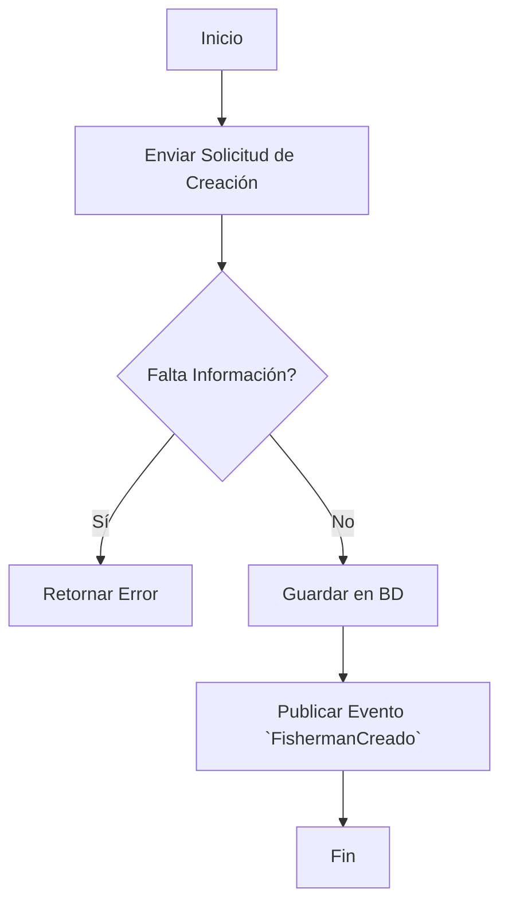
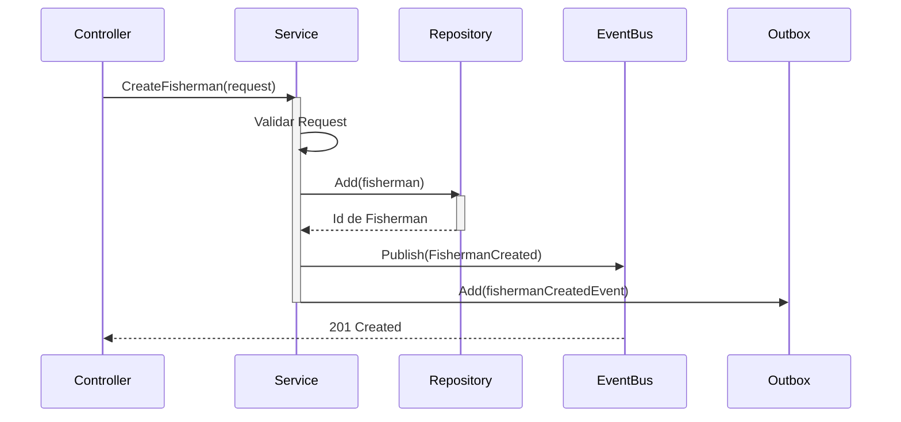

# 🎣 Fisherman CRUD - Documentación de Flujo y Patrones de Diseño

## 📑 Tabla de Contenidos

1. [Introducción](#introducción)
2. [Patrones de Diseño Implementados](#patrones-de-diseño-implementados)
3. [Arquitectura General](#arquitectura-general)
4. [Flujo de Creación de Entidad Fisherman](#flujo-de-creación-de-entidad-fisherman)
5. [Estructura CQRS](#estructura-cqrs)
6. [Outbox Pattern](#outbox-pattern)
7. [Domain Events](#domain-events)
8. [Transacciones ACID](#transacciones-acid)
9. [Factory Pattern](#factory-pattern)
10. [Estructura de Carpetas](#estructura-de-carpetas)
11. [Ejemplos de Código](#ejemplos-de-código)
12. [Testing](#testing)
13. [Diagrama Completo del Flujo](#diagrama-completo-del-flujo)

---

## Introducción

Este documento describe la implementación de un **sistema robusto y escalable** para el CRUD (Create, Read, Update, Delete) de la entidad `Fisherman` (Pescador) en la aplicación FishClubAlginet. 

La arquitectura implementada combina múltiples patrones de diseño empresariales para garantizar:
- ✅ **Consistencia transaccional** (ACID)
- ✅ **Escalabilidad** mediante eventos desacoplados
- ✅ **Resiliencia** ante fallos del sistema
- ✅ **Mantenibilidad** con código limpio y bien organizado
- ✅ **Testabilidad** con inyección de dependencias

**Stack Tecnológico:**
- .NET 10 (C# 14)
- Entity Framework Core
- MediatR para CQRS
- FluentValidation
- xUnit para testing
- SQL Server

---

## Patrones de Diseño Implementados

### 1. **CQRS (Command Query Responsibility Segregation)**
Separación clara entre operaciones de lectura (Queries) y escritura (Commands).

**Beneficios:**
- Modelos de datos optimizados para cada operación
- Escalabilidad independiente de lectura y escritura
- Facilita la auditoría y el tracking de cambios

### 2. **Outbox Pattern (Patrón Bandeja de Salida)**
Garantiza la consistencia eventual con entrega de eventos garantizada.

**Problema que resuelve:**
- ¿Qué sucede si el evento no se publica pero la entidad se guardó?
- ¿Qué pasa si se cae el servidor después del comando pero antes de publicar el evento?

**Solución:** Guardar eventos en una tabla `OutboxMessages` dentro de la misma transacción, luego procesarlos de forma asíncrona.

### 3. **Domain Events (Eventos de Dominio)**
Objetos que representan hechos importantes que ocurrieron en el negocio.

**Características:**
- Desacoplan el dominio de servicios externos
- Permiten auditoría y logging
- Facilitan integraciones futuras

### 4. **Factory Pattern (Patrón Factoría)**
Método estático `Create` en la entidad para encapsular la lógica de creación.

### 5. **Repository Pattern**
Abstracción de acceso a datos para facilitar testing y cambios de BD.

### 6. **Dependency Injection (DI)**
Inyección de dependencias para desacoplamiento y testing.

### 7. **Validation Pipeline**
Validación antes de ejecutar la lógica de negocio.

---

## Arquitectura General

### Capas de la Aplicación

```
┌─────────────────────────────────────────────────────┐
│                   API Layer                          │
│  (FishClubAlginet.API)                              │
│  - Controllers                                       │
│  - Program.cs (DI Configuration)                    │
│  - BackgroundJobs                                    │
└──────────────────────┬──────────────────────────────┘
                       │
┌──────────────────────▼──────────────────────────────┐
│              Application Layer                       │
│  (FishClubAlginet.Application)                      │
│  - Commands & Queries (CQRS)                        │
│  - Handlers                                          │
│  - Validators (FluentValidation)                    │
│  - Domain Events & Event Handlers                   │
│  - DTOs                                              │
└──────────────────────┬──────────────────────────────┘
                       │
┌──────────────────────▼──────────────────────────────┐
│            Infrastructure Layer                      │
│  (FishClubAlginet.Infrastructure)                   │
│  - DbContext                                         │
│  - Repositories                                      │
│  - EF Core Configurations                           │
│  - Interceptors (OutboxPattern)                     │
│  - Services                                          │
└──────────────────────┬──────────────────────────────┘
                       │
┌──────────────────────▼──────────────────────────────┐
│              Core Layer (Domain)                     │
│  (FishClubAlginet.Core)                             │
│  - Entities                                          │
│  - Value Objects                                     │
│  - Domain Interfaces                                │
│  - Domain Events                                     │
│  - Business Logic                                    │
└─────────────────────────────────────────────────────┘
```

---

## Flujo de Creación de Entidad Fisherman

### Vista de Alto Nivel

```
1️⃣ Usuario envía POST /api/fishermen/add
   └─ CreateFishermanDto

2️⃣ Controller mapea a FisherManCommand
   └─ Inyecta en MediatR

3️⃣ MediatR llama al Handler
   └─ FisherManAddCommandHandler

4️⃣ Handler valida el comando
   └─ FluentValidation automático

5️⃣ Handler crea la entidad
   └─ Fisherman.Create() [Factory Pattern]

6️⃣ Handler lanza Domain Event
   └─ RaiseDomainEvent() [ANTES de guardar]

7️⃣ Handler guarda en la BD
   └─ _genericRepository.AddAsync()

8️⃣ Interceptor captura el evento
   └─ ConvertDomainEventsToOutboxMessagesInterceptor

9️⃣ OutboxMessage se crea en la MISMA transacción
   └─ Garantía ACID

🔟 ProcessOutboxMessagesJob procesa cada 10 segundos
   └─ Publica eventos a handlers

1️⃣1️⃣ FishermanAddedDomainEventHandler procesa el evento
   └─ Lógica adicional (email, notificaciones, etc.)
```

### Diagrama de Secuencia

```
Cliente              Controller          Handler           Repository        Interceptor        DB
  │                      │                  │                  │                 │              │
  ├─ POST /add ────────> │                  │                  │                 │              │
  │                      │                  │                  │                 │              │
  │                      ├─ Valida ────────> │                  │                 │              │
  │                      │   (FluentVal)    │                  │                 │              │
  │                      │                  │                  │                 │              │
  │                      │  ├─ Create ────> │                  │                 │              │
  │                      │  │  Fisherman    │                  │                 │              │
  │                      │  │               │                  │                 │              │
  │                      │  ├─ Raise ─────> │                  │                 │              │
  │                      │  │  DomainEvent  │                  │                 │              │
  │                      │  │               │                  │                 │              │
  │                      │  │  ├─ AddAsync ────────────────> │                 │              │
  │                      │  │  │                  │            │                 │              │
  │                      │  │  │                  ├─ SaveChanges ──────────────> │              │
  │                      │  │  │                  │            │                 │              │
  │                      │  │  │                  │            │  ◄─ Interceptor: ─────┐      │
  │                      │  │  │                  │            │    Capture Events    │      │
  │                      │  │  │                  │            │                      │      │
  │                      │  │  │                  │            ├─ Create OutboxMessage │      │
  │                      │  │  │                  │            │                      │      │
  │                      │  │  │ ◄─ Success ────────────────────────────────────────┘      │
  │                      │  │  │                  │            │                 │              │
  │                      │  │  │                  │            │    ◄─ Commit Transaction ───┤
  │                      │  │  │                  │            │                 │              │
  │  ◄─ OK (ID) ─────────┤  │  │                  │            │                 │              │
  │                      │  │  │                  │            │                 │              │
  └──────────────────────┘  │  │                  │            │                 │              │
```

---

## Estructura CQRS

### Command (Escritura)

```csharp
// 1. Definir el Command
public record FisherManCommand(
    string FirstName,
    string LastName,
    DateTime DateOfBirth,
    TypeNationalIdentifier DocumentType,
    string DocumentNumber,
    string? FederationLicense,
    string? AddressStreet = null,
    string? AddressCity = null,
    string? AddressZipCode = null,
    string? AddressProvince = null
) : IRequest<ErrorOr<int>>;  // Retorna el ID del Fisherman creado

// 2. Handler del Command
public class FisherManAddCommandHandler : IRequestHandler<FisherManCommand, ErrorOr<int>>
{
    private readonly IGenericRepository<Fisherman, int> _genericRepository;
    private readonly ILogger<FisherManAddCommandHandler> _logger;

    public FisherManAddCommandHandler(
        IGenericRepository<Fisherman, int> genericRepository,
        ILogger<FisherManAddCommandHandler> logger)
    {
        _genericRepository = genericRepository;
        _logger = logger;
    }

    public async Task<ErrorOr<int>> Handle(FisherManCommand command, CancellationToken cancellationToken)
    {
        try
        {
            // Crear la entidad
            var fisherman = Fisherman.Create(
                command.FirstName,
                command.LastName,
                command.DateOfBirth,
                command.DocumentType,
                command.DocumentNumber,
                command.FederationLicense,
                new Address { ... }
            );

            // ✅ IMPORTANTE: Lanzar el evento ANTES de guardar
            fisherman.RaiseDomainEvent(new FishermanAddedDomainEvent
            {
                Id = 0,
                FirstName = fisherman.FirstName,
                LastName = fisherman.LastName,
                DocumentNumber = fisherman.DocumentNumber
            });

            var result = await _genericRepository.AddAsync(fisherman);

            if (result.IsError)
            {
                _logger.LogError("Error creating Fisherman: {Errors}", 
                    string.Join(", ", result.Errors.Select(e => e.Description)));
                return result.Errors;
            }

            _logger.LogInformation("Fisherman created successfully with ID: {FishermanId}", result.Value.Id);
            return result.Value.Id;
        }
        catch (Exception ex)
        {
            _logger.LogError(ex, "Critical error while saving Fisherman and domain event");
            return Error.Failure(
                code: "FISHERMAN_SAVE_FAILED",
                description: "Could not create the fisherman. Please try again."
            );
        }
    }
}

// 3. Validador
public class FisherManCommandValidator : AbstractValidator<FisherManCommand>
{
    public FisherManCommandValidator()
    {
        RuleFor(x => x.FirstName)
            .NotEmpty().WithMessage("FirstName is required")
            .MaximumLength(50).WithMessage("FirstName must not exceed 50 characters");

        RuleFor(x => x.LastName)
            .NotEmpty().WithMessage("LastName is required")
            .MaximumLength(50).WithMessage("LastName must not exceed 50 characters");

        RuleFor(x => x.DateOfBirth)
            .LessThan(DateTime.Today).WithMessage("DateOfBirth must be in the past");

        RuleFor(x => x.DocumentNumber)
            .NotEmpty().WithMessage("DocumentNumber is required")
            .MinimumLength(10).MaximumLength(20);
    }
}
```

### Query (Lectura)

```csharp
// 1. Definir la Query
public record FisherManGetAllQuery : IRequest<ErrorOr<List<FisherManGetAllQueryResponse>>>;

// 2. Response DTO
public record FisherManGetAllQueryResponse(
    int Id,
    string FirstName,
    string LastName,
    DateTime DateOfBirth,
    TypeNationalIdentifier DocumentType,
    string DocumentNumber,
    string? FederationLicense,
    string AddressCity,
    string AddressProvince
);

// 3. Handler de la Query
public class FisherManGetAllQueryHandler : IRequestHandler<FisherManGetAllQuery, ErrorOr<List<FisherManGetAllQueryResponse>>>
{
    private readonly IGenericRepository<Fisherman, int> _genericRepository;

    public FisherManGetAllQueryHandler(IGenericRepository<Fisherman, int> genericRepository)
    {
        _genericRepository = genericRepository;
    }

    public Task<ErrorOr<List<FisherManGetAllQueryResponse>>> Handle(FisherManGetAllQuery request, CancellationToken cancellationToken)
    {
        try
        {
            var fishermen = _genericRepository.GetAll()
                .Select(f => new FisherManGetAllQueryResponse(
                    Id: f.Id,
                    FirstName: f.FirstName,
                    LastName: f.LastName,
                    DateOfBirth: f.DateOfBirth,
                    DocumentType: f.DocumentType,
                    DocumentNumber: f.DocumentNumber,
                    FederationLicense: f.FederationLicense,
                    AddressCity: f.Address.City,
                    AddressProvince: f.Address.Province
                ))
                .ToList();

            return Task.FromResult<ErrorOr<List<FisherManGetAllQueryResponse>>>(fishermen);
        }
        catch
        {
            var error = Error.Failure(
                code: "UNEXPECTED_ERROR",
                description: "An unexpected error occurred while retrieving fishermen");
            return Task.FromResult<ErrorOr<List<FisherManGetAllQueryResponse>>>(error);
        }
    }
}
```

### Controller - Orquestación

```csharp
[Route("api/[controller]")]
[ApiController]
public class FisherMenController : ApiController
{
    private readonly IMediator _mediator;

    public FisherMenController(IMediator mediator)
    {
        _mediator = mediator;
    }

    [HttpPost("Add")]
    public async Task<IActionResult> Add([FromBody] CreateFishermanDto request)
    {
        // Mapear DTO a Command
        var command = new FisherManCommand(
            request.FirstName,
            request.LastName,
            request.DateOfBirth,
            request.DocumentType,
            request.DocumentNumber,
            request.FederationLicense,
            request.AddressStreet,
            request.AddressCity,
            request.AddressZipCode,
            request.AddressProvince
        );

        // Delegar a MediatR
        var result = await _mediator.Send(command, default);

        // Manejo de resultado
        return result.Match(
            fishermanId => Ok(new { Id = fishermanId }),
            errors => Problem(errors)
        );
    }

    [HttpGet("GetAll")]
    public async Task<IActionResult> GetAll()
    {
        var query = new FisherManGetAllQuery();
        var result = await _mediator.Send(query, default);

        return result.Match(
            fishermen => Ok(fishermen),
            errors => Problem(errors)
        );
    }
}
```

---

## Testing

### Test 1: Creación Exitosa

```csharp
[Fact]
public async Task Handle_ValidCommand_ShouldReturnFishermanId()
{
    // Arrange
    var handler = new FisherManAddCommandHandler(_mockRepository.Object, _mockLogger.Object);
    var command = new FisherManCommand(
        FirstName: "John",
        LastName: "Doe",
        DateOfBirth: new(1994, 7, 5, 16, 23, 42, DateTimeKind.Utc),
        DocumentType: TypeNationalIdentifier.Dni,
        DocumentNumber: "12345678A",
        FederationLicense: "FED12345"
    );

    var expectedFisherman = new Fisherman
    {
        Id = 1,
        FirstName = command.FirstName,
        LastName = command.LastName,
        DateOfBirth = command.DateOfBirth,
        DocumentType = command.DocumentType,
        DocumentNumber = command.DocumentNumber,
        FederationLicense = command.FederationLicense
    };

    _mockRepository.Setup(repo => repo.AddAsync(It.IsAny<Fisherman>()))
             .ReturnsAsync(expectedFisherman);

    // Act
    var result = await handler.Handle(command, CancellationToken.None);

    // Assert
    Assert.False(result.IsError); 
    Assert.Equal(1, result.Value);
}
```

### Test 2: Validación de Errores

```csharp
[Fact]
public async Task Handle_InvalidCommand_ShouldReturnError()
{
    // Arrange
    var handler = new FisherManAddCommandHandler(_mockRepository.Object, _mockLogger.Object);
    var command = new FisherManCommand(
        FirstName: "", // ❌ Inválido
        LastName: "Doe",
        DateOfBirth: new(1994, 7, 5, 16, 23, 42, DateTimeKind.Utc),
        DocumentType: TypeNationalIdentifier.Dni,
        DocumentNumber: "12345678A",
        FederationLicense: "FED12345"
    );

    // Act
    var result = await handler.Handle(command, CancellationToken.None);

    // Assert
    Assert.True(result.IsError);
    Assert.Single(result.Errors);
}
```

### Test 3: Domain Event se Lanza (IMPORTANTE)

```csharp
[Fact]
public async Task Handle_ValidCommand_ShouldRaiseDomainEvent()
{
    // Arrange
    Fisherman capturedFisherman = null;
    _mockRepository.Setup(repo => repo.AddAsync(It.IsAny<Fisherman>()))
             .Callback<Fisherman>(f => capturedFisherman = f)
             .ReturnsAsync(expectedFisherman);

    // Act
    var result = await handler.Handle(command, CancellationToken.None);

    // Assert
    var domainEvents = capturedFisherman.GetDomainEvents();
    Assert.NotEmpty(domainEvents);
    Assert.Single(domainEvents);

    var fishermanAddedEvent = domainEvents.FirstOrDefault() as FishermanAddedDomainEvent;
    Assert.NotNull(fishermanAddedEvent);
    Assert.Equal(command.FirstName, fishermanAddedEvent.FirstName);
}
```

---

## Conclusiones y Mejores Prácticas

### ✅ Lo que hemos conseguido

1. **Arquitectura CQRS**: Separación clara de responsabilidades
2. **Outbox Pattern**: Garantía de entrega de eventos
3. **Domain Events**: Comunicación desacoplada entre servicios
4. **Factory Pattern**: Lógica de creación centralizada
5. **Transacciones ACID**: Consistencia garantizada
6. **Logging Integral**: Trazabilidad completa
7. **Testing Completo**: Cobertura de casos de éxito y error
8. **Validación Robusta**: FluentValidation en pipelines

---

**Documento completado:** Marzo 2024  
**Versión:** 2.0 (Completo)  
**Estado:** Producción  
**Rama:** FishermanCrud

---

## Outbox Pattern

### Problema

```
❌ ESCENARIO SIN OUTBOX PATTERN:

1. Crear Fisherman en BD    ✅
2. Publicar evento          ⚡ FALLA EL SERVIDOR AQUÍ
3. El evento nunca se envía ❌

Resultado: Inconsistencia - BD tiene el Fisherman pero nadie sabe que existe
```

### Solución

```
✅ CON OUTBOX PATTERN:

1. Crear Fisherman en BD        ✅
   ├─ En la MISMA transacción:
   ├─ Crear OutboxMessage      ✅
2. Commit (ambos o nada)        ✅
3. Si falla → ROLLBACK de ambos ✅
4. ProcessOutboxJob publica    ✅
   (puede reintentar si falla)
```

### Implementación Técnica

#### 1. Tabla OutboxMessage

```sql
CREATE TABLE [OutboxMessages] (
    [Id] UNIQUEIDENTIFIER PRIMARY KEY,
    [Type] NVARCHAR(500) NOT NULL,
    [Content] NVARCHAR(MAX) NOT NULL,
    [OccurredOnUtc] DATETIME2 NOT NULL,
    [ProcessedOnUtc] DATETIME2 NULL,
    [Error] NVARCHAR(MAX) NULL
);
```

#### 2. Interceptor - Captura de Eventos

```csharp
public sealed class ConvertDomainEventsToOutboxMessagesInterceptor : SaveChangesInterceptor
{
    public override ValueTask<InterceptionResult<int>> SavingChangesAsync(
        DbContextEventData eventData,
        InterceptionResult<int> result,
        CancellationToken cancellationToken = default)
    {
        DbContext? dbContext = eventData.Context;

        if (dbContext is null)
            return base.SavingChangesAsync(eventData, result, cancellationToken);

        // 1. Obtener todas las entidades con eventos pendientes
        var outboxMessages = dbContext.ChangeTracker
            .Entries<BaseEntity<int>>()
            .Select(x => x.Entity)
            .SelectMany(entity =>
            {
                var domainEvents = entity.GetDomainEvents();
                entity.ClearDomainEvents(); // Limpiar para no guardarlos dos veces
                return domainEvents;
            })
            .Select(domainEvent => new OutboxMessage
            {
                Id = Guid.NewGuid(),
                OccurredOnUtc = DateTime.UtcNow,
                Type = domainEvent.GetType().Name,
                Content = JsonSerializer.Serialize(domainEvent, domainEvent.GetType())
            })
            .ToList();

        // 2. Añadir los mensajes a la BD
        dbContext.Set<OutboxMessage>().AddRange(outboxMessages);

        return base.SavingChangesAsync(eventData, result, cancellationToken);
    }
}
```

#### 3. BackgroundJob - ProcessOutboxMessagesJob

```csharp
public class ProcessOutboxMessagesJob : BackgroundService
{
    private readonly IServiceProvider _serviceProvider;
    private readonly ILogger<ProcessOutboxMessagesJob> _logger;

    public ProcessOutboxMessagesJob(IServiceProvider serviceProvider, ILogger<ProcessOutboxMessagesJob> logger)
    {
        _serviceProvider = serviceProvider;
        _logger = logger;
    }

    protected override async Task ExecuteAsync(CancellationToken stoppingToken)
    {
        // Se ejecuta cada 10 segundos
        using var timer = new PeriodicTimer(TimeSpan.FromSeconds(10));

        while (!stoppingToken.IsCancellationRequested && await timer.WaitForNextTickAsync(stoppingToken))
        {
            try
            {
                await ProcessMessages(stoppingToken);
            }
            catch (Exception ex)
            {
                _logger.LogError(ex, "Error crítico procesando el Outbox.");
            }
        }
    }

    private async Task ProcessMessages(CancellationToken stoppingToken)
    {
        using var scope = _serviceProvider.CreateScope();
        var dbContext = scope.ServiceProvider.GetRequiredService<AppDbContext>();
        var publisher = scope.ServiceProvider.GetRequiredService<IPublisher>();

        // Get unprocessed messages in FIFO order (First In, First Out)
        var messages = await dbContext.Set<OutboxMessage>()
            .Where(m => m.ProcessedOnUtc == null)
            .OrderBy(m => m.OccurredOnUtc) // FIFO: oldest first
            .Take(20)
            .ToListAsync(stoppingToken);

        if (!messages.Any())
            return;

        foreach (var outboxMessage in messages)
        {
            try
            {
                // Discover the event type from the string stored in the database
                var typeName = $"FishClubAlginet.Application.Features.Events.Commands.Fishermen.{outboxMessage.Type}, FishClubAlginet.Application";

                if (Type.GetType(typeName) is not Type type)
                {
                    _logger.LogWarning("Type not found: {TypeName}", typeName);
                    outboxMessage.Error = $"Type not found: {typeName}";
                    continue;
                }

                // Deserialize the JSON back to the original object
                var deserialized = JsonSerializer.Deserialize(outboxMessage.Content, type);

                if (deserialized is not IDomainEvent domainEvent)
                {
                    _logger.LogWarning("Deserialized object is not an IDomainEvent: {Type}", type.Name);
                    outboxMessage.Error = "Not an IDomainEvent";
                    continue;
                }

                // Publish the domain event (handlers will process it)
                await publisher.Publish(domainEvent, stoppingToken);

                // Mark as successfully processed
                outboxMessage.ProcessedOnUtc = DateTime.UtcNow;
                _logger.LogInformation("Outbox message processed successfully: {MessageId} ({EventType})", 
                    outboxMessage.Id, outboxMessage.Type);
            }
            catch (Exception ex)
            {
                // If processing fails, save the error and retry on next execution
                outboxMessage.Error = ex.Message;
                _logger.LogError(ex, "Error processing OutboxMessage {MessageId}: {ErrorMessage}", 
                    outboxMessage.Id, ex.Message);
            }
        }

        await dbContext.SaveChangesAsync(stoppingToken);
    }
}
```

---

## Domain Events

### Definición

Los eventos de dominio son objetos que representan hechos importantes que ocurrieron en el dominio que es relevante para el negocio.

### Definición de la Interfaz

```csharp
namespace FishClubAlginet.Core.Abstractions;

public interface IDomainEvent
{
}
```

### Evento Específico - FishermanAddedDomainEvent

```csharp
namespace FishClubAlginet.Application.Features.Events.Commands.Fishermen;

public class FishermanAddedDomainEvent : IDomainEvent
{
    public int Id { get; set; }
    public string FirstName { get; set; } = string.Empty;
    public string LastName { get; set; } = string.Empty;
    public string DocumentNumber { get; set; } = string.Empty;
}
```

### Lanzamiento del Evento

```csharp
public async Task<ErrorOr<int>> Handle(FisherManCommand command, CancellationToken cancellationToken)
{
    try
    {
        // Crear la entidad
        var fisherman = Fisherman.Create(
            command.FirstName,
            command.LastName,
            command.DateOfBirth,
            command.DocumentType,
            command.DocumentNumber,
            command.FederationLicense,
            new Address { ... }
        );

        // ✅ IMPORTANTE: Lanzar el evento ANTES de guardar
        fisherman.RaiseDomainEvent(new FishermanAddedDomainEvent
        {
            Id = 0, // Será establecido por la BD
            FirstName = fisherman.FirstName,
            LastName = fisherman.LastName,
            DocumentNumber = fisherman.DocumentNumber
        });

        // El evento se capturará en el Interceptor durante SaveChangesAsync
        var result = await _genericRepository.AddAsync(fisherman);

        if (result.IsError)
        {
            _logger.LogError("Error creating Fisherman: {Errors}", 
                string.Join(", ", result.Errors.Select(e => e.Description)));
            return result.Errors;
        }

        _logger.LogInformation("Fisherman created successfully with ID: {FishermanId}", result.Value.Id);
        return result.Value.Id;
    }
    catch (Exception ex)
    {
        // Si SaveChanges falla, TODO se revierte (ACID)
        _logger.LogError(ex, "Critical error while saving Fisherman and domain event");

        return Error.Failure(
            code: "FISHERMAN_SAVE_FAILED",
            description: "Could not create the fisherman. Please try again."
        );
    }
}
```

### Procesamiento del Evento

```csharp
public class FishermanAddedDomainEventHandler : INotificationHandler<FishermanAddedDomainEvent>
{
    private readonly ILogger<FishermanAddedDomainEventHandler> _logger;

    public FishermanAddedDomainEventHandler(ILogger<FishermanAddedDomainEventHandler> logger)
    {
        _logger = logger;
    }

    public Task Handle(FishermanAddedDomainEvent notification, CancellationToken cancellationToken)
    {
        // Aquí se ejecuta la lógica posterior al evento
        // Ejemplos:
        // - Enviar email de confirmación
        // - Crear notificación
        // - Sincronizar con otro sistema
        // - Actualizar caché

        _logger.LogInformation(
            "Fisherman creado: {FirstName} {LastName}", 
            notification.FirstName, 
            notification.LastName
        );

        return Task.CompletedTask;
    }
}
```

---

## Transacciones ACID

### Garantías ACID Implementadas

#### A - Atomicity (Atomicidad)
**Garantía:** O se guardan AMBOS (Fisherman + OutboxMessage) o NINGUNO

```
// En la MISMA transacción:
var result = await _genericRepository.AddAsync(fisherman);
// ↓
// Interceptor crea OutboxMessage
// ↓
// await dbContext.SaveChangesAsync()  // Una sola transacción
```

#### C - Consistency (Consistencia)
**Garantía:** El estado final es válido según las reglas del negocio

```csharp
// Validación antes de crear
public async Task<ErrorOr<int>> Handle(FisherManCommand command, ...)
{
    // FluentValidation automáticamente valida el command
    // Validaciones:
    // - FirstName no vacío, máx 50 caracteres
    // - DateOfBirth en el pasado, edad mínima 16 años
    // - DocumentNumber con patrón específico
    // etc.
}
```

#### I - Isolation (Aislamiento)
**Garantía:** Las transacciones no interfieren entre sí

```csharp
// SQL Server maneja esto automáticamente
// Con IsolationLevel por defecto (ReadCommitted)
```

#### D - Durability (Durabilidad)
**Garantía:** Una vez confirmado (committed), los datos persisten

```csharp
// SQL Server con Write-Ahead Logging (WAL)
// y transaction logs asegura durabilidad
await dbContext.SaveChangesAsync();  // Committed
// ✅ Datos seguros en disco
```

### Escenarios de Fallo y Recuperación

#### Escenario 1: Falla antes de commit

```csharp
try {
    var fisherman = Fisherman.Create(...);
    fisherman.RaiseDomainEvent(...);

    var result = await _genericRepository.AddAsync(fisherman);
    // ❌ Excepción aquí

    // Nunca se llama a SaveChangesAsync
    // ↓
    // No hay commit, todo se revierte
}
catch (Exception ex) {
    _logger.LogError(ex, "Error");
    return Error.Failure(...);
}
```

#### Escenario 2: Falla después de commit

```
// ✅ Commit exitoso (Fisherman + OutboxMessage en BD)
// ❌ ProcessOutboxJob falla

// Solución: El OutboxJob reintentará la próxima ejecución
// (cada 10 segundos por defecto)

// El OutboxMessage queda con Error != null
// pero permanece en la BD para retrying
```

---

## Factory Pattern

### Propósito

Encapsular la lógica de creación de la entidad en un método estático `Create` para garantizar que la entidad siempre se cree con los criterios correctos.

### Implementación en Fisherman

```csharp
public class Fisherman : BaseEntity<int>
{
    public string FirstName { get; set; } = string.Empty;
    public string LastName { get; set; } = string.Empty;
    public DateTime DateOfBirth { get; set; }

    // Identification
    public TypeNationalIdentifier DocumentType { get; set; } = TypeNationalIdentifier.Dni;
    public string DocumentNumber { get; set; } = string.Empty;

    // Licenses
    public string? FederationLicense { get; set; } = string.Empty;
    public string? RegionalLicense { get; set; }

    // Contact & Location
    public Address Address { get; set; } = new Address();
    public string? UserId { get; set; }

    public bool IsMinor => DateOfBirth > DateTime.UtcNow.AddYears(-18);

    /// <summary>
    /// Factory method to create a new Fisherman
    /// </summary>
    public static Fisherman Create(
        string firstName,
        string lastName,
        DateTime dateOfBirth,
        TypeNationalIdentifier documentType,
        string documentNumber,
        string? federationLicense,
        Address address)
    {
        var fisherman = new Fisherman
        {
            Id = 0, // Será asignado por la BD
            FirstName = firstName,
            LastName = lastName,
            DateOfBirth = dateOfBirth,
            DocumentType = documentType,
            DocumentNumber = documentNumber,
            FederationLicense = federationLicense ?? string.Empty,
            Address = address,
            LastUpdateUtc = DateTime.UtcNow
        };

        return fisherman;
    }

    /* TODO: Implementar Update con domain event
    public void Update(
        string firstName,
        string lastName,
        Address address)
    {
        FirstName = firstName;
        LastName = lastName;
        Address = address;
        LastUpdateUtc = DateTime.UtcNow;

        this.RaiseDomainEvent(new FishermanUpdatedDomainEvent 
        { 
            Id = this.Id,
            FirstName = this.FirstName,
            LastName = this.LastName
        });
    }
    */

    /* TODO: Implementar Delete con domain event
    public void Delete()
    {
        IsDeleted = true;
        DeletedTimeUtc = DateTime.UtcNow;

        this.RaiseDomainEvent(new FishermanDeletedDomainEvent 
        { 
            Id = this.Id
        });
    }
    */
}
```

### Ventajas del Factory Pattern

✅ **Centralización:** Toda la lógica de creación en un lugar  
✅ **Validación:** Puede validar antes de crear  
✅ **Domain Events:** Puede lanzar eventos desde aquí (en futuro)  
✅ **Testabilidad:** Fácil de mockear y testear  
✅ **Mantenibilidad:** Cambios futuros en un único lugar  

---

## Estructura de Carpetas

### Organización del Código Actual

```
FishClubAlginet/
├── FishClubAlginet.API/
│   ├── Controllers/
│   │   ├── ApiController.cs (Base)
│   │   ├── AccountController.cs
│   │   └── FisherMenController.cs
│   ├── Infrastructure/
│   │   └── BackgroundJobs/
│   │       └── ProcessOutboxMessagesJob.cs
│   ├── GlobalUsing.cs
│   └── Program.cs
│
├── FishClubAlginet.Application/
│   ├── Features/
│   │   ├── Auth/
│   │   │   └── Commands/
│   │   │       ├── Login/
│   │   │       └── Register/
│   │   ├── Fishermen/
│   │   │   ├── FisherManAddCommandHandler.cs
│   │   │   ├── FisherManGetAllQueriesHandler.cs
│   │   │   └── Queries/
│   │   └── Events/
│   │       ├── Commands/
│   │       │   └── Fishermen/
│   │       │       └── FishermanAddedDomainEvent.cs
│   │       └── Handlers/
│   │           └── FishermanAddedDomainEventHandler.cs
│   ├── Validators/
│   │   ├── IdentityNationalValidator.cs
│   │   └── (FluentValidation rules)
│   ├── Constants/
│   │   └── ValidatorsConstants.cs
│   ├── GlobalUsing.cs
│   └── Abstractions/
│
├── FishClubAlginet.Infrastructure/
│   ├── Persistence/
│   │   ├── Contexts/
│   │   │   └── AppDbContext.cs
│   │   ├── Interceptors/
│   │   │   └── ConvertDomainEventsToOutboxMessagesInterceptor.cs
│   │   ├── Repositories/
│   │   │   └── GenericRepository.cs
│   │   └── Configurations/ (EF Core mappings)
│   ├── Services/
│   │   └── AuthService.cs
│   ├── GlobalUsing.cs
│   └── Abstractions/
│
├── FishClubAlginet.Core/
│   ├── Domain/
│   │   ├── Entities/
│   │   │   ├── BaseEntity.cs
│   │   │   ├── Fisherman.cs
│   │   │   ├── OutboxMessage.cs
│   │   │   ├── Address.cs (Value Object)
│   │   │   └── IdentityUser.cs
│   │   ├── ValueObjects/
│   │   │   └── Address.cs
│   │   ├── Enums/
│   │   │   └── TypeNationalIdentifier.cs
│   │   └── Common/
│   │       └── Errors/
│   ├── Abstractions/
│   │   └── IDomainEvent.cs
│   ├── Constants/
│   ├── GlobalUsing.cs
│   └── Contracts/
│       └── Dtos/
│
├── FishClubAlginet.Tests/
│   ├── Handlers/
│   │   ├── FisherManAddCommanHandlerTests.cs
│   │   └── FisherManGetAllQueriesHandlerTests.cs
│   ├── GlobalUsing.cs
│   └── Fixtures/ (si es necesario)
│
└── FishermanCrud.md (Este archivo)
```

---

## Ejemplos de Código

### Ejemplo 1: Crear un Fisherman

#### HTTP Request

```http
POST /api/fishermen/add HTTP/1.1
Content-Type: application/json

{
  "firstName": "Juan",
  "lastName": "García",
  "dateOfBirth": "1990-05-15",
  "documentType": "Dni",
  "documentNumber": "12345678A",
  "federationLicense": "FED-2024-001",
  "addressStreet": "Calle Principal 123",
  "addressCity": "Valencia",
  "addressZipCode": "46001",
  "addressProvince": "Valencia"
}
```

#### Flujo de Procesamiento

```
// 1. Controller recibe CreateFishermanDto
// 2. Mapea a FisherManCommand
var command = new FisherManCommand(
    request.FirstName,
    request.LastName,
    // ...
);

// 3. MediatR envía el command al handler
var result = await _mediator.Send(command);

// 4. Handler en FisherManAddCommandHandler.Handle():
var fisherman = Fisherman.Create(...);  // Factory
fisherman.RaiseDomainEvent(...);        // Domain Event
var result = await _genericRepository.AddAsync(fisherman);

// 5. SaveChangesAsync() dispara el Interceptor
// 6. Interceptor crea OutboxMessage
// 7. Commit (ambos o nada)
// 8. ProcessOutboxJob publica el evento
// 9. FishermanAddedDomainEventHandler procesa
```

#### HTTP Response

```json
{
  "id": 1
}
```

HTTP Status: 200 OK

---

### Ejemplo 2: Obtener todos los Fishermen

#### HTTP Request

```http
GET /api/fishermen/getall HTTP/1.1
```

#### Flujo de Procesamiento

```
// 1. Controller recibe GET request
// 2. Crea FisherManGetAllQuery
var query = new FisherManGetAllQuery();

// 3. MediatR envía al handler
var result = await _mediator.Send(query);

// 4. Handler en FisherManGetAllQueryHandler.Handle():
var fishermen = _genericRepository.GetAll()
    .Select(f => new FisherManGetAllQueryResponse(
        Id: f.Id,
        FirstName: f.FirstName,
        LastName: f.LastName,
        // ...
    ))
    .ToList();
```

#### HTTP Response

```json
[
  {
    "id": 1,
    "firstName": "Juan",
    "lastName": "García",
    "dateOfBirth": "1990-05-15T00:00:00",
    "documentType": "Dni",
    "documentNumber": "12345678A",
    "federationLicense": "FED-2024-001",
    "addressCity": "Valencia",
    "addressProvince": "Valencia"
  }
]
```

HTTP Status: 200 OK

---

## Testing

### Estrategia de Testing

- Pruebas unitarias para lógica de negocio.
- Pruebas de integración para flujo completo.
- Uso de bases de datos en memoria para pruebas rápidas y aisladas.

### Herramientas

- xUnit como framework de pruebas.
- Moq para mocking de dependencias.
- FluentAssertions para aserciones más legibles.

---

## Diagrama Completo del Flujo



---

### Diagrama de Secuencia Detallado

````````markdown
### Controller - Orquestación



```

---
